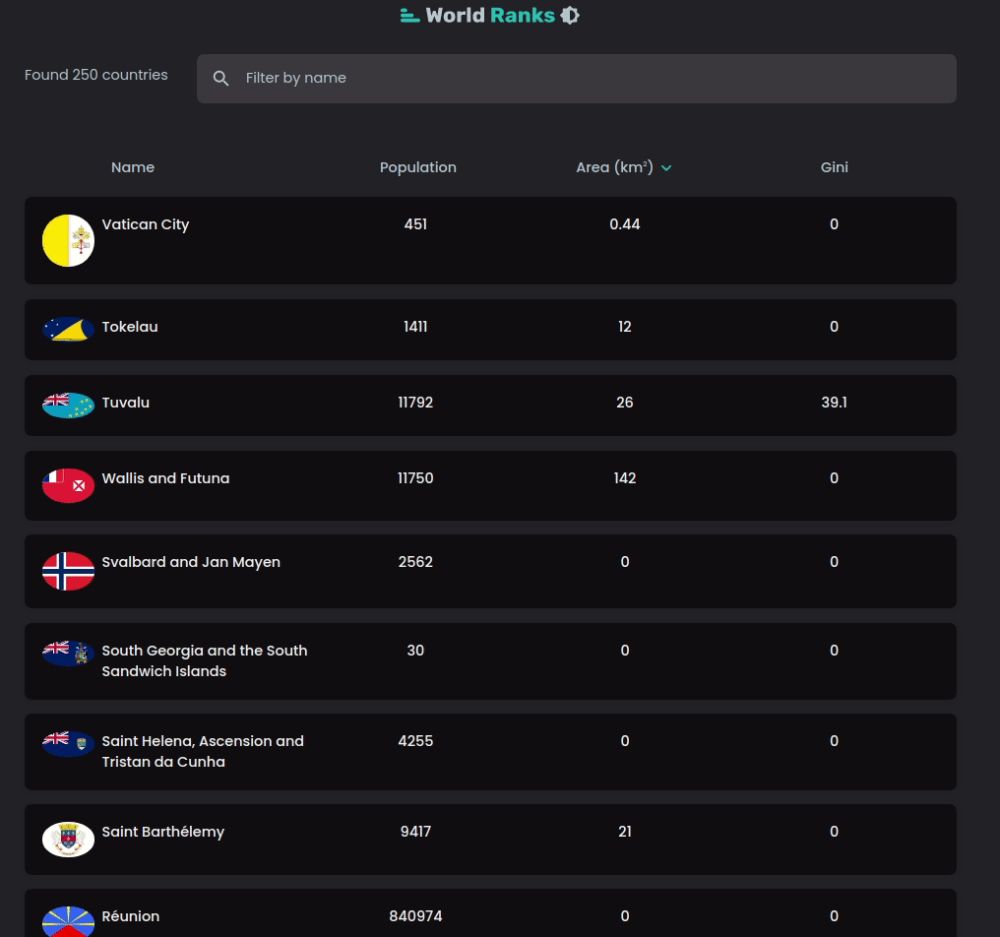
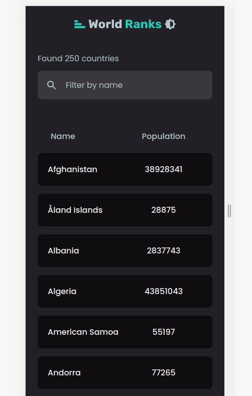

## This is simple app the shows all the coutries and its detail information

### Tech used:

```
"@material-ui/core": "^4.12.3",
"@material-ui/icons": "^4.11.2",
"next": "12.0.7",
"react": "17.0.2",
"react-dom": "17.0.2"
```

## DEMO: Desktop



## DEMO: Responsive


